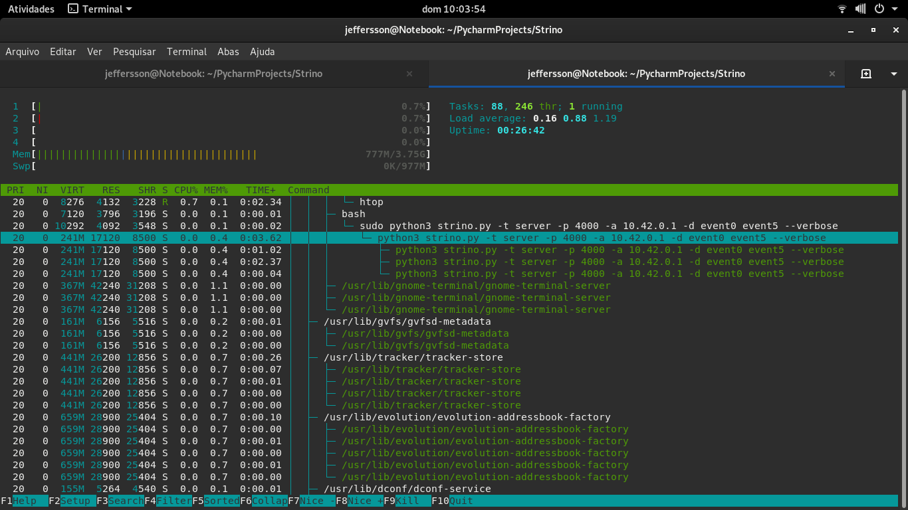

<!-- PROJECT LOGO -->
<br />
<p align="center">
  <a href="https://github.com/ctw6av/Strino">
    
  </a>

  <h3 align="center">Strino</h3>

  <p align="center">
    A simple way to share your peripherals devices
    <br />
    <a href="https://github.com/ctw6av/Strino">
        <strong>Explore the docs »</strong>
    </a>
    <br />
    <br />
    <a href="https://github.com/ctw6av/Strino">View Demo</a>
    ·
    <a href="https://github.com/ctw6av/Strino/issues">Report Bug</a>
    ·
    <a href="https://github.com/ctw6av/Strino/issues">Request Feature</a>
  </p>


<!-- TABLE OF CONTENTS -->
<details open="open">
  <summary>Table of Contents</summary>
  <ol>
    <li>
      <a href="#about-the-project">About Strino</a>
    </li>
    <li>
      <a href="#getting-started">Getting Started</a>
      <ul>
        <li><a href="#installation">Installation</a></li>
      </ul>
    </li>
    <li><a href="#usage">Usage</a></li>
    <li><a href="#license">License</a></li>
    <li><a href="#contact">Contact</a></li>
  </ol>
</details>


<!-- ABOUT THE PROJECT -->
## About Strino



Strino comes from the simply need of share a mouse and keyboard from computers running any GNU/Linux OS 
(operating system) in the same LAN (Local Address Network). The thrust why I decided to write a program like Strino is
once I dropped water in my old keyboard and had no money to buy a new one. It's being a nice challenge to write in a hight
level language (Python) a program like Strino that uses low level code almost all the time. So why use Strino?

Here's why:
* Do not mess up your working table. If you use a laptop + desktop, like me, so run Strino server from laptop and use it's keyboard
  in desktop.
* Use only one mouse and keyboard to control how many machines you want.
* Forget about wire limitations.

Of course, no program will serve all projects since your needs may be different. So I'll be adding more in the near 
future. You may also suggest changes by forking this repo and creating a pull request or opening an issue. Thanks to 
all the people have contributed to expanding this program!

<!-- GETTING STARTED -->
## Getting Started

Since Strino has no thirdparty dependency to work, the instalation process is too easy and clean.
To get a local copy up and running follow these simple example steps.

### Prerequisites

You will only need git to clone this repository and use Strino. Git not comes with the most GNU/Linux systems, so we need to install it.
* Git - (Debian based)
  ```sh
  $ sudo apt update
  $ sudo apt install git-all
  ```

### Installation

1. Clone the repo
   ```sh
   git clone https://github.com/ctw6av/Strino.git
   ```
2. Change the directory to Strino root
   ```sh
   cd Strino
   ```

3. Open the [```settings.ini```](https://github.com/ctw6av/Strino/blob/master/settings.ini) configuration file and see 
   some default values. You can edit this file however you want, so we won't have the need for CLI parameters   
   ```sh
   $ cat settings.ini
   ```
   
4. Get a list of all devices and theirs respective handlers available
   ```
    $ sudo python3 strino.py --list 
   
    Handler    Device name
    event0     AT Translated Set 2 keyboard
    event1     Lid Switch
    event2     Power Button
    event3     Power Button
    event4     Video Bus
    event5     Dell Dell USB Optical Mouse
    event6     ETPS/2 Elantech Touchpad
    event7     PC Speaker
    event8     Ideapad extra buttons
    event9     HDA Intel HDMI HDMI/DP,pcm=3
    event10    HDA Intel HDMI HDMI/DP,pcm=7
    event11    HDA Intel HDMI HDMI/DP,pcm=8
    event12    HDA Intel HDMI HDMI/DP,pcm=9
    event13    HDA Intel HDMI HDMI/DP,pcm=10
    event14    HDA Intel PCH Mic
    event15    HDA Intel PCH Headphone
    event16    Lenovo EasyCamera: Lenovo EasyC
   
   ```
   
5. Start Strino server by passing as devices the handlers that we get by running with ```--list``` option. May you do not 
   want a verbose output so just remove the --verbose flag the output will be 
   redirected only to a file placed in your home folder.
   ```sh
   python3 strino.py -t server -p PORT -a ADDR --devices event0 event5 --verbose
   ```

6. Once a client connect to the server we can change the peripherals focus using a shortcut. These keys are configurable
   and lives in a file called [```settings.ini```](https://github.com/ctw6av/Strino/blob/master/settings.ini) so edit this file to change
   the shortcuts. Once the clients are disposed inline by arriving use:
   ```
   Ctrl + -►  # Change focus to right
   Ctrl + ◄-  # Change focus to left   
   ```
   

<!-- USAGE EXAMPLES -->
## Usage

1. Run with -h or --help to more detailed usages
   ```
    $ sudo python3 strino.py --help
    usage: strino.py [-h] [-a ADDR] [-p PORT] [-l] [-v] [-t TYPE]
                 [-d [DEVICES [DEVICES ...]]]

    Share your IO in unix like operating systems with Strino.
    
    optional arguments:
      -h, --help            show this help message and exit
      -a ADDR, --addr ADDR  Enter the server address to connect
      -p PORT, --port PORT  Enter the server port to connect
      -l, --list            List of available devices to share
      -v, --verbose         Increase the output verbosity
      -t TYPE, --type TYPE  Enter the type (server or client)
      -d [DEVICES [DEVICES ...]], --devices [DEVICES [DEVICES ...]]
                            Devices handlers list to share

   ```

2. Get a list of all devices available
   ```
    $ sudo python3 strino.py --list 
   
    Handler    Device name
    event0     AT Translated Set 2 keyboard
    event1     Lid Switch
    event2     Power Button
    event3     Power Button
    event4     Video Bus
    event5     Dell Dell USB Optical Mouse
    event6     ETPS/2 Elantech Touchpad
    event7     PC Speaker
    event8     Ideapad extra buttons
    event9     HDA Intel HDMI HDMI/DP,pcm=3
    event10    HDA Intel HDMI HDMI/DP,pcm=7
    event11    HDA Intel HDMI HDMI/DP,pcm=8
    event12    HDA Intel HDMI HDMI/DP,pcm=9
    event13    HDA Intel HDMI HDMI/DP,pcm=10
    event14    HDA Intel PCH Mic
    event15    HDA Intel PCH Headphone
    event16    Lenovo EasyCamera: Lenovo EasyC
   
   ```


<!-- LICENSE -->
## License

Distributed under the MIT License. See [`LICENSE`](https://github.com/ctw6av/Strino/blob/master/LICENCE.md) for more information.

<!-- CONTACT -->
## Contact

Jeffersson Abreu - [@facebook](https://www.facebook.com/jeffersson.abreu) - ctw6av@gmail.com

Project Link: [https://github.com/ctw6av/Strino](https://github.com/ctw6av/Strino)
